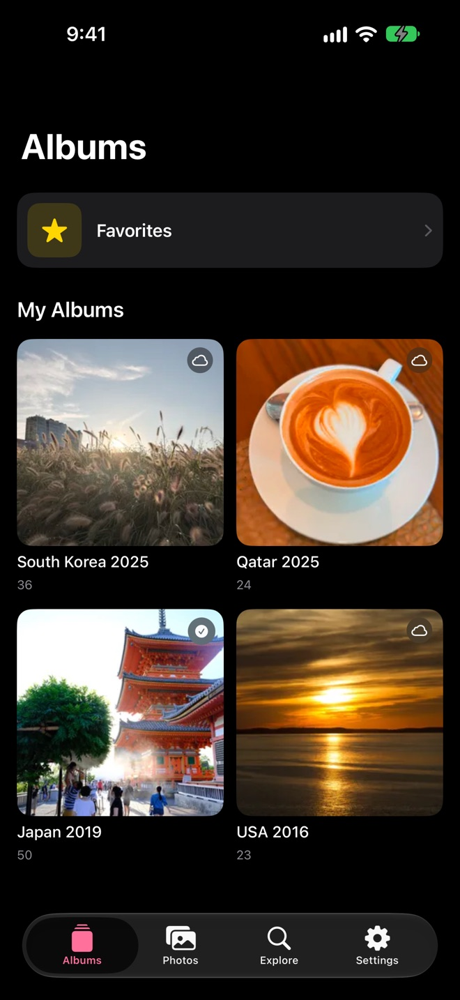
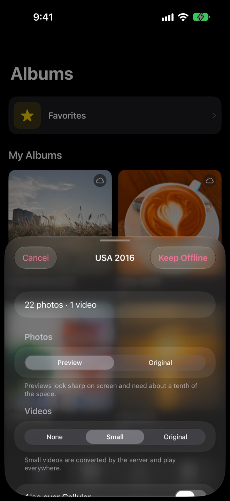
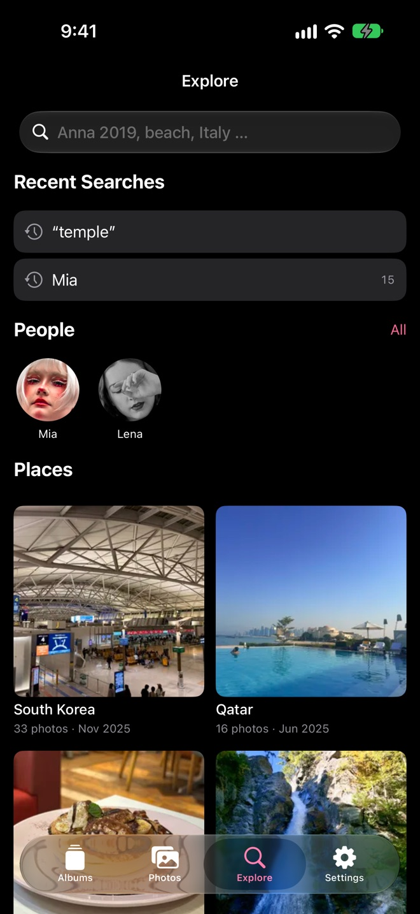
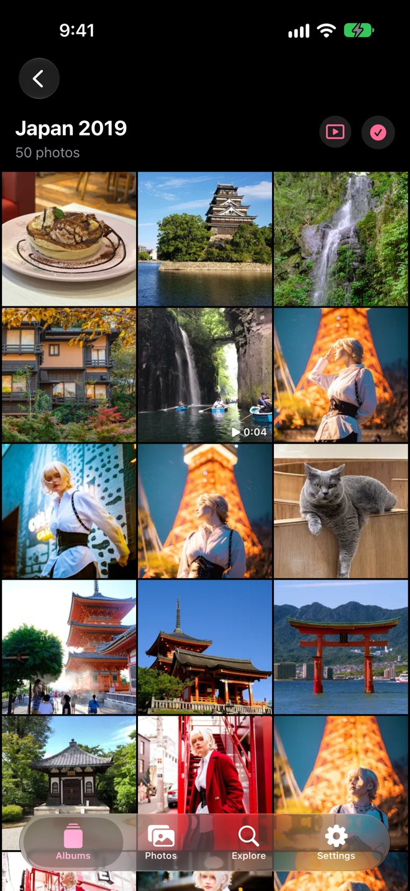

<p align="center">
  <picture>
    <source media="(prefers-color-scheme: dark)" srcset="Resources/Marke/banner-dunkel.png">
    
  </picture>
</p>

# Pocket Album for Immich

**Your albums and photos from your own [Immich](https://immich.app/) server — fast to show, easy to find, and even offline.**

Pocket Album is a native iOS client written in Swift, SwiftUI and SwiftData.

> Unofficial. Pocket Album is not affiliated with or endorsed by the Immich project.

<p align="center">
  
  
  
  
</p>

<sub>Screenshots use a demo server. Photos of people are from <a href="https://www.pexels.com">Pexels</a>.</sub>

## Why another Immich iOS app?

The [official Immich app](https://github.com/immich-app/immich) is excellent — it backs up your
phone, manages your library and does far more than Pocket Album ever will. Use it.

Pocket Album does one thing: **showing and finding** photos. It has no backup and no upload.
What it focuses on instead:

- **Albums first.** The app opens on your albums, not on a timeline.
- **Deliberately offline.** Pick the albums you want on the phone; they're downloaded in full
  and work without any connection — on a plane, at grandma's, in a basement.
- **Find it in two taps.** Start from a person, a country, a year — or just type
  “Anna 2019”, “Italy last summer” or “beach”.
- **A slideshow for the TV.** AirPlay or an external display shows the photos full screen
  while the phone becomes the remote.
- **Native.** Swift and SwiftUI throughout, no cross-platform layer.

It runs happily next to the official app on the same phone and server.

## Features

- **Albums** — your own and shared albums; keep any album on the phone for offline viewing
- **Photos** — your whole library, grouped by day, filterable by photos/videos
- **Explore**
  - search that understands people, years, time spans (“last summer”, “since 2020”),
    countries (also in German), cities, “videos” and “favorites”; anything else goes to
    Immich's smart search (CLIP)
  - recent searches, your most photographed people, countries and years as entry points
  - combine freely: country + year + people, refine with city, year and people chips
- **Viewer** — pinch to zoom, video playback, favorite, move to trash
- **Slideshow** — also on AirPlay / an external display, with the phone as remote
- **Guided setup** — animated intro, live server check, API key check that shows what the key
  may do, or sign in once and let the app create its own key
- English and German, light and dark mode, an app icon that follows the system look (light, dark, tinted, clear)

### Smart Albums (optional)

An extra *Smart Albums* section appears in the Albums tab only if your server has albums whose
name starts with `✦ ` (a four-pointed star followed by a space). These are created by a
companion Mac app that isn't public yet; the phone doesn't evaluate any rules, it just collects
albums with that prefix. You can name an album that way yourself if you like the separate section.

## Install

Pocket Album is not in the App Store yet. Until then, build it yourself (see [Building](#building)).

## Requirements

- iPhone with iOS 26 or later
- An Immich server, **v3.2.0 or later**

### API key permissions

Create a key in Immich (web → Account Settings → API Keys) with these permissions — or use
“sign in instead” during setup and the app creates one for you.

| Permission | Needed for |
|---|---|
| `album.read` | albums (required) |
| `asset.read`, `asset.view` | photos, search, thumbnails, video playback |
| `asset.download` | offline albums, sharing originals |
| `asset.statistics` | counts and filter chips in Explore |
| `person.read` | people in Explore |
| `asset.update` *(optional)* | favorite button |
| `asset.delete` *(optional)* | move to trash |

Want a read-only app? Leave out `asset.update` and `asset.delete` — the favorite and trash
buttons disappear. Without `person.read`, Explore simply has no people section.

## Building

You need Xcode 26 and [XcodeGen](https://github.com/yonaskolb/XcodeGen).

```bash
brew install xcodegen
cp Local.xcconfig.example Local.xcconfig   # team ID only needed for a real device
xcodegen generate
open PocketAlbum.xcodeproj
```

The app scheme is **`ImmichPhone`** (the target kept its original name); pick it and run on
a simulator. For a real iPhone, put your team ID and a bundle ID prefix of your own into
`Local.xcconfig`.

Run the tests:

```bash
xcodebuild test -project PocketAlbum.xcodeproj -scheme ImmichPhoneTests \
  -destination 'platform=iOS Simulator,name=iPhone 17 Pro,OS=latest'
```

## Project layout

| Path | What |
|---|---|
| `Sources/Shared` | Platform-neutral core: API client, models, search parser, caching |
| `Sources/ImmichPhone` | The iOS app |
| `Tests/ImmichPhoneTests` | Tests (Swift Testing) |

The only third-party dependency is [Nuke](https://github.com/kean/Nuke) for image loading.

A note on the code: Pocket Album grew out of a private Mac client, and the shared core still
contains code only that app uses. Code comments and many identifiers are in German; the UI is
fully localized.

## Privacy

Pocket Album talks only to the server you enter. No analytics, no crash reporting, no
third-party services. Your API key is stored on the phone in a file only the app can read,
protected by iOS data protection and excluded from backups; if you use “sign in instead”,
your password is used once to create a key and is never stored. Details: [PRIVACY.md](PRIVACY.md).

Plain `http://` addresses are allowed so that servers on your home network or VPN work.
Your API key travels unencrypted in that case — use `https://` whenever you reach your
server over the internet.

## Support and security

Questions and bugs: [GitHub Issues](https://github.com/ralksta/pocket-album/issues).
Security problems: please report them privately, see [SECURITY.md](SECURITY.md).

## License

MIT — see [LICENSE](LICENSE).
